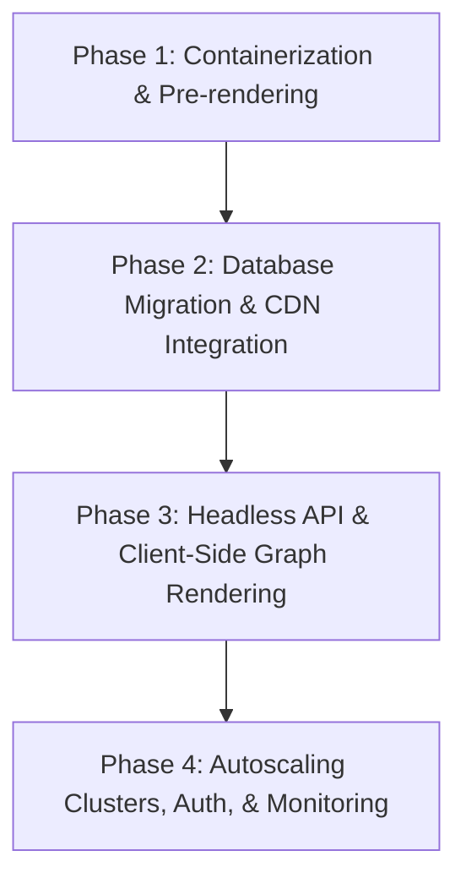
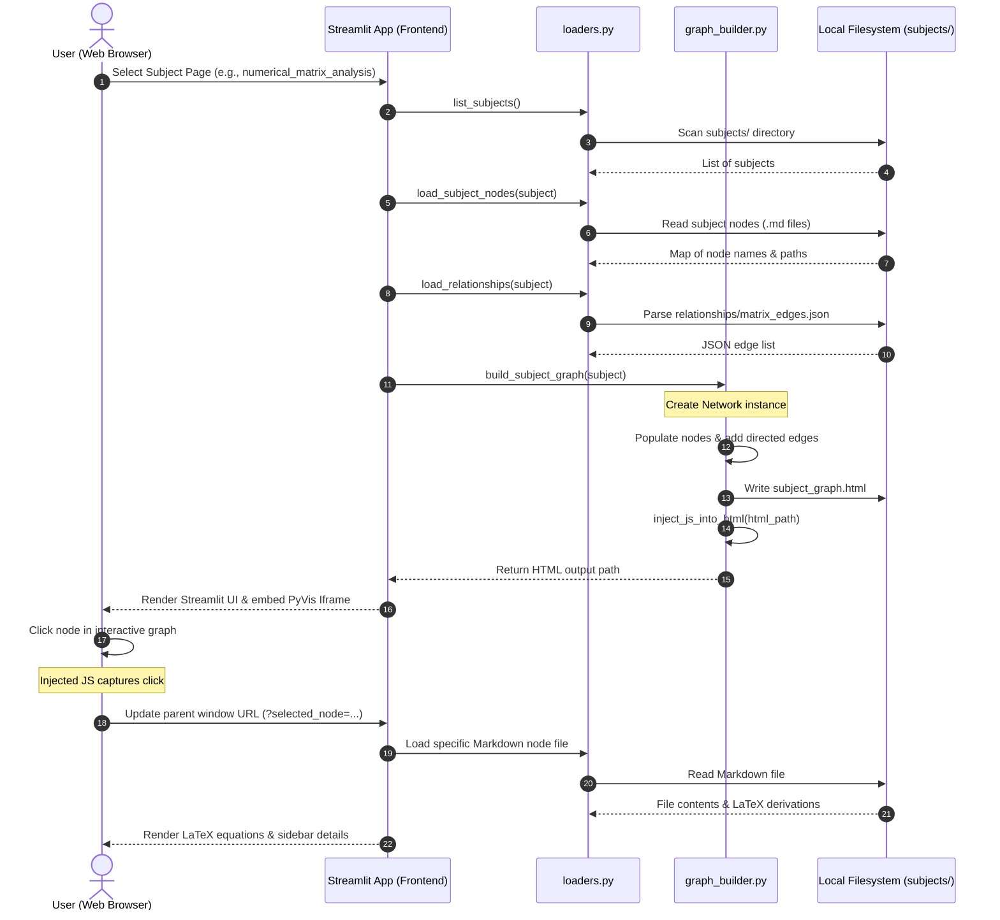

# 📚 Knowledge Graph Math Explorer

An interactive, Streamlit-based knowledge graph explorer for university-level mathematics subjects.
Build, visualise, browse, and edit concept graphs — with full LaTeX rendering, narrative readers, derivation explorers, and a step-by-step Simplex solver — all driven by plain Markdown files and JSON edge lists.

---

## Table of Contents

1. [Project Overview](#1-project-overview)
2. [Tech Stack](#2-tech-stack)
3. [Architecture Overview](#3-architecture-overview)
4. [Installation & Setup](#4-installation--setup)
5. [Usage Guide](#5-usage-guide)
6. [API Reference](#6-api-reference)
7. [Environment Variables](#7-environment-variables)
8. [Contributing Guide](#8-contributing-guide)
9. [License](#9-license)

---

## 1. Project Overview

### The Problem

Advanced mathematics courses (numerical analysis, optimisation, machine learning theory, etc.) generate dense webs of related concepts: theorems depend on lemmas, algorithms rely on decompositions, and proofs reference earlier results. Standard notes and PDFs offer no way to *navigate* these relationships or see which concepts are central, duplicated, or missing.

### What This Project Does

**Knowledge Graph Math Explorer** turns a folder of Markdown concept-files and JSON edge-lists into a fully interactive knowledge graph:

| Capability | Details |
|---|---|
| **Graph visualisation** | Interactive force-directed graph (PyVis / vis.js) with clickable nodes |
| **Node browsing** | Browse every concept, render its Markdown + LaTeX inline |
| **Derivation viewer** | Step through mathematical derivations in their own reader |
| **Narrative reader** | Read auto-clustered "chapter" narratives generated from the graph |
| **Edge editor** | Add, edit, delete, and filter relationships directly in the UI |
| **Duplicate detection** | Fuzzy-match nodes and relations within and across subjects |
| **Node QA / cleanup** | Identify incomplete nodes, merge aliases, log all changes |
| **Simplex solver** | Interactive step-by-step simplex tableau explorer |
| **Cross-subject view** | Merge multiple subjects into a single global knowledge graph |

### Who Is It For?

- Students who want a navigable map of a course's concept space
- Lecturers building structured course materials
- Researchers maintaining a personal mathematical knowledge base

---

## 2. Tech Stack

### Language & Runtime

| Layer | Technology |
|---|---|
| Language | Python 3.11+ |
| Web framework | [Streamlit](https://streamlit.io/) |

### Core Libraries

| Library | Purpose |
|---|---|
| `streamlit` | Multi-page web app UI |
| `pyvis` | Interactive graph HTML generation (wraps vis.js) |
| `networkx` | Graph data structures, clustering algorithms |
| `python-louvain` | Louvain community detection |
| `numpy` | Numerical computation (Simplex tableau) |
| `pandas` | DataFrame display and edge manipulation |
| `matplotlib` | Optional chart rendering |
| `difflib` | Fuzzy string matching for duplicate detection |
| `re` | LaTeX delimiter normalisation |

### Data Formats

| Format | Usage |
|---|---|
| `.md` (Markdown) | Concept nodes, derivations, narrative chapters |
| `.json` | Edge lists (`matrix_edges.json`), subject metadata (`index.json`) |
| `.html` | Pre-rendered graph files written by PyVis |
| `.txt` | Merge and edit audit logs |

---

## 3. Architecture Overview

### High-Level Flow

```
subjects/
  <subject>/
    nodes/          ← Markdown concept files
    derivations/    ← Step-by-step derivation Markdown files
    narrative/      ← Chapter Markdown files
    relationships/
      matrix_edges.json   ← directed edge list
    index.json      ← subject metadata
          │
          ▼
  utils/loaders.py        ← discovers and loads all content
  utils/file_reader.py    ← reads Markdown, normalises LaTeX
  utils/graph_builder.py  ← builds PyVis HTML graphs
          │
          ▼
  streamlit_app/
    streamlit_app.py      ← landing page & subject listing
    pages/
      01_View_KG.py       ← interactive graph + node sidebar
      02_Search_Node.py   ← full-text node search
      03_Subject_Browser.py ← select subject → node → render MD
      04_Derivation_Explorer.py
      05_Narrative_Reader.py
      06_Node_Cleanup.py  ← QA: incomplete nodes, merge tool
      07_Edge_Explorer.py ← CRUD editor for edges
      08_Node_List.py     ← node list + duplicate detection
      09_Edge_Improver.py ← relation normalisation & fuzzy QA
      0_Global_Narrative.py ← clustering → auto-chapter view
      10_Simplex.py       ← interactive simplex tableau
      11_Simplex_data.py  ← guided simplex walkthrough
```

### Component Responsibilities

```
┌─────────────────────────────────────────────────────────────┐
│                        Streamlit Pages                       │
│  (UI, session state, URL params, user interaction)          │
└────────────────────┬────────────────────────────────────────┘
                     │ calls
          ┌──────────▼──────────┐
          │     utils/           │
          │  loaders.py          │  ← filesystem discovery
          │  file_reader.py      │  ← Markdown + LaTeX cleaning
          │  graph_builder.py    │  ← PyVis HTML generation
          └──────────┬──────────┘
                     │ reads
          ┌──────────▼──────────┐
          │    subjects/         │
          │  (Markdown + JSON)   │
          └─────────────────────┘
```

### Data Flow — Graph Viewer

```
User opens page 01_View_KG
  → selectbox picks subject
  → build_subject_graph(subject)
      → load_subject_nodes()      reads nodes/*.md → dict {name: path}
      → load_relationships()      reads matrix_edges.json → list[dict]
      → PyVis Network             adds nodes (blue) + edges
      → inject_js_into_html()     appends click-handler JS
  → st.components.v1.html()       renders HTML inside iframe
  → User clicks node → JS updates ?selected_node= in parent URL
  → Streamlit rerun reads st.query_params → sidebar updates
```

### Edge Schema (`matrix_edges.json`)

```json
[
  { "source": "Vector_Norms", "target": "Matrix_Norms", "relation": "induces" },
  { "source": "LU_Factorization", "target": "Gaussian_Elimination", "relation": "implements" }
]
```

### Node File Convention (`nodes/<Name>.md`)

```markdown
Type: Theorem
Domain: Numerical Linear Algebra
Prerequisites: Vector_Norms, Floating_Point_Arithmetic
Related Nodes: Matrix_Norms, Conditioning

## Definition
...body with $LaTeX$ inline and $$display$$ math...
```

---

## 4. Installation & Setup

### Prerequisites

- Python **3.11** or later
- `pip` (or a virtual environment manager such as `venv` / `conda`)
- Git

### Step 1 — Clone the repository

```bash
git clone https://github.com/<your-username>/knowledge_graph_math.git
cd knowledge_graph_math
```

### Step 2 — Create and activate a virtual environment

```bash
python -m venv .venv

# macOS / Linux
source .venv/bin/activate

# Windows (PowerShell)
.venv\Scripts\Activate.ps1
```

### Step 3 — Install dependencies

The canonical requirements file lives inside `streamlit_app/`:

```bash
pip install -r streamlit_app/requirements.txt
```

<details>
<summary>Full dependency list</summary>

```
streamlit
numpy>=2.1.0
pandas>=2.1
matplotlib
networkx
python-louvain
pyvis
requests
openai
```

</details>

### Step 4 — Add your subject data (optional for first run)

The repo already includes `subjects/numerical_matrix_analysis/` as a working example. To add a new subject, create a folder matching the structure below:

```
subjects/
└── my_new_subject/
    ├── index.json
    ├── nodes/
    │   └── My_Concept.md
    ├── derivations/
    │   └── My_Derivation.md
    ├── narrative/
    │   └── 01_intro.md
    └── relationships/
        └── matrix_edges.json
```

Minimum `index.json`:

```json
{
  "subject": "My New Subject",
  "description": "A short description shown on the landing page."
}
```

### Step 5 — Run the app

```bash
cd streamlit_app
streamlit run streamlit_app.py
```

The app opens at **http://localhost:8501** by default.

> **Note:** Run from inside `streamlit_app/` so that relative `sys.path` resolution works correctly for all pages.

### Step 6 — Regenerate the project directory listing (optional)

```bash
# From the repo root
python structure_code.py
```

This overwrites `project_directory.md` with a fresh collapsible HTML tree.

---

## 5. Usage Guide

### Landing Page

The landing page (`streamlit_app.py`) lists every subject found under `subjects/`. Subjects with an `index.json` show their human-readable name and description; others show their folder name.

Use the **left sidebar** to navigate between pages.

---

### Page 01 — Knowledge Graph Viewer

**Purpose:** Explore the concept graph visually.

1. Choose **Subject Graph** or **Global Graph** with the radio button.
2. For Subject Graph, pick a subject from the dropdown — the graph renders immediately.
3. **Click any blue node** in the graph → the sidebar updates to show that node.
4. Click **📖 Open Markdown Page** to jump directly to that node's full content in the Subject Browser.
5. Use the **Search Node** dropdown in the sidebar to jump to any node by name.

> Blue nodes have a Markdown file. Grey nodes appear only in edge definitions and have no content file yet.

---

### Page 02 — Node Browser

1. Select a subject.
2. Type a keyword in **Filter nodes** to narrow the list.
3. Select a node from the dropdown — its full Markdown (with rendered LaTeX) appears below.

---

### Page 03 — Subject Browser

1. Pick a subject and a node.
2. The Markdown content renders with full LaTeX support (`$inline$`, `$$display$$`).
3. Metadata (Type, Domain, Prerequisites, Related Nodes) is extracted from the file header and shown in a structured panel below.

---

### Page 04 — Derivation Explorer

Browse and read step-by-step derivations for a subject. Derivation files live in `subjects/<subject>/derivations/`.

---

### Page 05 — Narrative Reader

Read narrative chapter files from `subjects/<subject>/narrative/`. Chapters are plain Markdown and support full LaTeX rendering.

---

### Page 06 — Node Cleanup & QA

| Section | What it does |
|---|---|
| ✅ Complete Nodes | Lists nodes that have at least one metadata field (domain, definition, description). Download as JSON. |
| ⚠️ Incomplete Nodes | Lists nodes with **no** metadata at all. Download as JSON. |
| 🔧 Merge Tool | Select an incomplete node and a target node; all edges referencing the old name are rewritten and a log entry is appended to `merge_log.txt`. |

---

### Page 07 — Edge Explorer & Editor

- **Filter** edges by source, target, or relation text.
- **Edit** source, target, or relation label inline and click **💾 Save All Changes**.
- **Delete** individual edges with the ❌ button.
- **Add** a new edge with the ➕ Add New Relationship form.
- Nodes missing a Markdown file are labelled **❗** in all dropdowns.

---

### Page 08 — Node List & Duplicate Finder

- View the full node list derived from the edge file.
- Adjust the **fuzzy match threshold** slider and find similar node names (likely duplicates).
- Enable **cross-subject check** to find the same concept appearing under different names in different subjects.

---

### Page 09 — Edge Improver

- **Duplicate edge detection** — exact (`source`, `target`, `relation`) triples that appear more than once.
- **Near-duplicate relations** — fuzzy-matched relation names that are probably the same (`used_in` vs `uses_in`, etc.).
- **Edit / Fix Relations** — update a specific relation label for a `(source, target)` pair; the change is written back to disk and logged.
- **Add / Delete** individual edges.

---

### Page 0 — Global Narrative (auto-chapters)

1. Select a subject.
2. Choose a **clustering algorithm** (Louvain recommended; requires `python-louvain`).
3. Adjust **Max chapters** and **Match sensitivity**.
4. The app clusters the graph and writes a Markdown chapter overview ranked by cluster size and PageRank centrality.
5. Download the narrative as a `.md` file.

---

### Page 10 — Simplex Step-by-Step Explorer

An interactive simplex tableau with a hardcoded example problem (6 variables, 4 constraints):

- Toggle **Auto-select pivot** to let the app choose the entering/leaving variable.
- Enable **Manual pivot selection** to pick the pivot column and row yourself.
- Click **Apply auto pivot** or **Apply manual pivot** to execute a pivot step.
- Use **Undo last step** to step back.
- **Export current tableau to CSV** at any time.

---

### Page 11 — Simplex Guided Walkthrough

A narrated, step-by-step walkthrough of the specific LP:

```
min  -12 x₁ - 9 x₂
s.t. x₁         ≤ 1000
         x₂     ≤ 1500
     x₁ + x₂   ≤ 1750
     4x₁ + 2x₂ ≤ 4800
     x₁, x₂    ≥ 0
```

Use **Next Step / Prev Step / Reset** to walk through:

- **Step 0** — Initial basic feasible solution (B = I)
- **Step 1** — Choose entering variable (most negative obj coefficient)
- **Step 2** — Compute u = B⁻¹aⱼ and perform ratio test
- **Step 3** — Pivot and update tableau + basis
- **Step 4+** — Continue simplex iterations

---

## 6. API Reference

This project is a **self-contained Streamlit application** — there are no HTTP API endpoints. The public Python interface is the `utils/` module, which is imported by all pages.

### `utils/loaders.py`

| Function | Signature | Returns | Description |
|---|---|---|---|
| `list_subjects` | `() → list[str]` | Sorted list of subject folder names | Reads `subjects/` directory |
| `load_subject_nodes` | `(subject: str) → dict[str, str]` | `{node_name: abs_path}` | Finds all `.md` files in `nodes/` |
| `load_subject_derivations` | `(subject: str) → dict[str, str]` | `{name: abs_path}` | Finds all `.md` in `derivations/` |
| `load_subject_narratives` | `(subject: str) → dict[str, str]` | `{name: abs_path}` | Finds all `.md` in `narrative/` |
| `load_relationships` | `(subject: str) → list[dict]` | Edge list from `matrix_edges.json` | Raises `FileNotFoundError` if missing |
| `load_all_nodes` | `(search: str = "") → list[tuple]` | `[(subject, name, path), …]` | Global node search across all subjects |
| `get_node_subject` | `(node_name: str) → str or None` | Subject name or `None` | Finds which subject owns a node |

### `utils/file_reader.py`

| Function | Signature | Returns | Description |
|---|---|---|---|
| `read_markdown` | `(path: str) → str` | Cleaned Markdown string | Reads file, normalises LaTeX delimiters |
| `clean_latex` | `(text: str) → str` | Cleaned string | Converts `\[…\]` → `$$…$$`, `\(…\)` → `$…$`, then fixes matrix rows |
| `fix_matrix_rows` | `(latex: str) → str` | String with fixed row endings | Normalises trailing `\` to `\\\\` inside `$$` blocks |

### `utils/graph_builder.py`

| Function | Signature | Returns | Description |
|---|---|---|---|
| `build_subject_graph` | `(subject: str) → str` | Path to generated `.html` | Builds PyVis graph for one subject |
| `build_global_graph` | `() → str` | Path to generated `.html` | Merges all subjects from `global_kg/merged_graph.json` |
| `inject_js_into_html` | `(html_path: str) → None` | — | Appends node-click JS to a PyVis HTML file (idempotent) |

### Edge Object Schema

All edge lists follow this schema:

```python
{
    "source":   str,   # source node name (must match a .md filename stem)
    "target":   str,   # target node name
    "relation": str    # directed relationship label, e.g. "induces", "used_in"
}
```

---

## 7. Environment Variables

This project requires **no mandatory environment variables** for basic operation.

The following optional variable is used if you extend the project with AI-powered features (e.g. node enrichment via the OpenAI API, which is already listed in `requirements.txt`):

| Variable | Required | Default | Description |
|---|---|---|---|
| `OPENAI_API_KEY` | Optional | — | API key for OpenAI. Needed only if you implement AI-assisted node generation or enrichment. |

### Setting variables

Create a `.env` file in the **repo root** (never commit this file):

```bash
# .env
OPENAI_API_KEY=sk-...
```

Then load it in any script with:

```python
from dotenv import load_dotenv
load_dotenv()
```

> **Note:** `python-dotenv` is not in the current `requirements.txt`. Add it if you use `.env` files:
> ```bash
> pip install python-dotenv
> ```

---

## 8. Contributing Guide

Contributions are welcome! Please follow the guidelines below to keep the project consistent and easy to maintain.

### Getting Started

1. **Fork** the repository on GitHub.
2. **Clone** your fork locally:
   ```bash
   git clone https://github.com/<your-username>/knowledge_graph_math.git
   ```
3. Create a feature branch:
   ```bash
   git checkout -b feat/my-new-feature
   ```

### Ways to Contribute

| Type | Examples |
|---|---|
| **New subject** | Add a new `subjects/<subject>/` folder with nodes, edges, and narratives |
| **New node** | Add a `.md` file to an existing subject's `nodes/` folder |
| **Bug fix** | Fix broken logic in any `utils/` or `pages/` file |
| **New page** | Add a new Streamlit page under `streamlit_app/pages/` |
| **Documentation** | Improve this README or add docstrings |

### Code Style

- Follow **PEP 8** (line length ≤ 100 characters).
- Add docstrings to every function using Google-style format.
- Add inline comments for non-obvious logic.
- Do not commit dead / commented-out code blocks — delete them or open an issue instead.

### Adding a New Subject

1. Create the folder structure:
   ```
   subjects/
   └── <subject_name>/
       ├── index.json
       ├── nodes/
       ├── derivations/
       ├── narrative/
       └── relationships/
           └── matrix_edges.json
   ```
2. Write `index.json`:
   ```json
   {
     "subject": "Human-Readable Subject Name",
     "description": "One sentence describing what this subject covers."
   }
   ```
3. Write at least one `.md` node file and one edge in `matrix_edges.json`.
4. Run the app and verify the subject appears on the landing page.

### Commit Message Convention

Use the [Conventional Commits](https://www.conventionalcommits.org/) format:

```
feat: add derivation viewer for QR factorisation
fix: resolve broken path in build_subject_graph when cwd != streamlit_app
docs: update architecture section of README
refactor: extract _make_network() helper in graph_builder
```

### Pull Request Checklist

- [ ] All new functions have docstrings
- [ ] No dead commented-out code blocks
- [ ] `requirements.txt` updated if a new dependency was added
- [ ] The app starts without errors (`streamlit run streamlit_app.py`)
- [ ] PR description explains *what* changed and *why*

### Reporting Issues

Open a GitHub Issue with:

- A clear title
- Steps to reproduce
- Expected vs actual behaviour
- Relevant error messages or screenshots

---

## 9. License

This project is released under the **MIT License**.

```
MIT License

Copyright (c) 2025 Daris Dzakwan Hoesien

Permission is hereby granted, free of charge, to any person obtaining a copy
of this software and associated documentation files (the "Software"), to deal
in the Software without restriction, including without limitation the rights
to use, copy, modify, merge, publish, distribute, sublicense, and/or sell
copies of the Software, and to permit persons to whom the Software is
furnished to do so, subject to the following conditions:

The above copyright notice and this permission notice shall be included in all
copies or substantial portions of the Software.

THE SOFTWARE IS PROVIDED "AS IS", WITHOUT WARRANTY OF ANY KIND, EXPRESS OR
IMPLIED, INCLUDING BUT NOT LIMITED TO THE WARRANTIES OF MERCHANTABILITY,
FITNESS FOR A PARTICULAR PURPOSE AND NONINFRINGEMENT. IN NO EVENT SHALL THE
AUTHORS OR COPYRIGHT HOLDERS BE LIABLE FOR ANY CLAIM, DAMAGES OR OTHER
LIABILITY, WHETHER IN AN ACTION OF CONTRACT, TORT OR OTHERWISE, ARISING FROM,
OUT OF OR IN CONNECTION WITH THE SOFTWARE OR THE USE OR OTHER DEALINGS IN THE
SOFTWARE.
```

---

## 10. Scaling Guide

This section outlines how to transition the **Knowledge Graph Math Hub** from a single-user local tool to a production-grade, highly available, and scalable public-facing platform.

### 1. Current Bottlenecks
Under load (e.g., 50+ concurrent users), the following components will degrade or fail first:
* **I/O-Bound Filesystem Scans:** Functions like [`list_subjects`](file:///home/ubuntu/apps/fixing_repo/knowledge_graph_math/streamlit_app/utils/loaders.py#L12), [`load_subject_nodes`](file:///home/ubuntu/apps/fixing_repo/knowledge_graph_math/streamlit_app/utils/loaders.py#L25), and [`load_relationships`](file:///home/ubuntu/apps/fixing_repo/knowledge_graph_math/streamlit_app/utils/loaders.py#L78) query the local directory structure on every single user interaction. As the number of subjects and nodes increases, filesystem scans (`os.walk` and `os.listdir`) become a severe bottleneck.
* **On-the-Fly PyVis Graph Generation:** The PyVis graph creation ([`build_subject_graph`](file:///home/ubuntu/apps/fixing_repo/knowledge_graph_math/streamlit_app/utils/graph_builder.py#L70) and [`build_global_graph`](file:///home/ubuntu/apps/fixing_repo/knowledge_graph_math/streamlit_app/utils/graph_builder.py#L120)) runs dynamically. It writes physical `.html` files (e.g., `numerical_matrix_analysis_graph.html`) directly into the active working directory. Under concurrent requests, this causes CPU spikes (calculating layouts), write amplification, and file lock/race conditions where one user's rendering overwrites another's.
* **Streamlit Concurrency & Memory Model:** Streamlit starts a new thread per user session and keeps session state in memory. WebSocket connections are kept open continuously. A single Streamlit instance is bound by Python's Global Interpreter Lock (GIL) and will experience thread exhaustion and high RAM usage under moderate concurrent load.
* **Import Architecture:** The codebase uses runtime `sys.path.append` paths, which makes deploying it as a standard package or in distributed serverless runtimes fragile.

---

### 2. Database Scaling
Moving away from flat markdown/JSON files is necessary to support scaling.

* **Database Migration Path:**
  * **Phase 1 (Low Scale):** Package the parsed node, derivation, and edge files into a read-only SQLite database bundled directly inside the application container.
  * **Phase 2 (Production Scale):** Migrate to **PostgreSQL**.
    * A `nodes` table stores the parsed Markdown properties, LaTeX contents, and metadata.
    * An `edges` table represents relationships, storing `source_node_id`, `target_node_id`, and `relation_type`.
* **Indexing Strategy:**
  * Create a **B-Tree Index** on foreign keys: `edges(source_node_id)` and `edges(target_node_id)` to speed up adjacent node discovery and subgraph queries.
  * Create a **GIN (Generalized Inverted Index)** on node math content/descriptions to support fast full-text searching across all subjects.
* **Caching:**
  * Deploy a **Redis** cluster to cache expensive database queries and the results of graph-clustering runs (e.g., Louvain community detection).
* **Sharding and Read Replicas:**
  * Since the workload is 99% read-heavy (only updating when content creators publish new math subjects), database sharding is unnecessary. 
  * Instead, implement **Read Replicas**. Route write traffic (publishing new subjects) to a primary master database, and load-balance read queries across multiple read replicas.

---

### 3. Backend Scaling
To handle high traffic, separate the UI from backend data operations:

* **FastAPI Decoupling:** Extract all graph queries and file parsing into a separate, stateless REST API built with **FastAPI**. The frontend will query this API instead of reading directly from storage.
* **Horizontal vs. Vertical Scaling:**
  * *Vertical:* Scaling up resources (CPU/RAM) only delays resource exhaustion because of Python's GIL.
  * *Horizontal:* Containerize both the FastAPI backend and Streamlit UI using Docker. Run multiple container instances across an orchestrator.
* **Load Balancing and Session Affinity:**
  * Place an Application Load Balancer (ALB) or Nginx in front of the container instances.
  * **Important:** Configure **Sticky Sessions (Session Affinity)** on the load balancer for the Streamlit containers. Streamlit relies on persistent WebSocket connections; without sticky sessions, user connections will drop and reset.
* **Asynchronous Workers:**
  * Offload graph generation from the synchronous HTTP request lifecycle. Use a task queue like **Celery** with Redis as a broker to generate graph layouts in the background when node files are modified.

---

### 4. Frontend Scaling
* **CDN (Content Delivery Network) Integration:**
  * Save pre-rendered graph visualizations to an object storage bucket (e.g., AWS S3 or GCP Cloud Storage) and serve them globally via a CDN (e.g., CloudFront, Cloud CDN). Frontends embed these graphs using standard iframes referencing the CDN URLs, bypassing app servers entirely.
* **Lazy Loading:**
  * Configure graph iframes to use `loading="lazy"` so that heavy WebGL/Vis.js canvases are only rendered when the user scrolls them into view.
* **Client-Side Rendering (CSR):**
  * Replace the PyVis backend rendering engine with client-side libraries like **Sigma.js**, **Cytoscape.js**, or **D3.js**.
  * The server only sends raw, lightweight JSON lists of nodes/edges. The user's browser performs the canvas rendering and physics simulations, removing significant compute load from the servers.
* **SSG (Static Site Generation):**
  * For public-facing math repositories, use **Next.js** or **Astro** to statically build mathematical definition pages at deploy time. This provides sub-second load times and SEO-friendly rendering of complex LaTeX formulas.

---

### 5. Infrastructure Setup
We recommend deploying the application on managed cloud services to automate scaling, security, and orchestration.

| Component | AWS Recommendation | GCP Recommendation | Azure Recommendation |
| :--- | :--- | :--- | :--- |
| **Container Compute** | ECS (Fargate) | Cloud Run | Azure Container Apps |
| **Relational Database** | RDS PostgreSQL | Cloud SQL for PostgreSQL | Azure Database for PostgreSQL |
| **In-Memory Cache** | ElastiCache (Redis) | Cloud Memorystore | Azure Cache for Redis |
| **Object Storage** | Amazon S3 | Google Cloud Storage | Azure Blob Storage |
| **Global CDN** | Amazon CloudFront | Google Cloud CDN | Azure CDN |
| **Domain & DNS** | Route 53 | Cloud DNS | Azure DNS |
| **Secrets & Keys** | AWS Secrets Manager | Cloud Secret Manager | Azure Key Vault |

---

### 6. Cost Estimate
The table below details rough estimated costs for hosting a scalable, production-grade cloud setup across user tiers.

| Resource / Tier | MVP (~1,000 Users/Mo) | Growth (~10,000 Users/Mo) | Scale (~100,000 Users/Mo) |
| :--- | :--- | :--- | :--- |
| **Compute Instances** | $0 - $10 / mo (1x Cloud Run container) | $30 - $60 / mo (2-3 auto-scaling containers) | $200 - $400 / mo (Orchestrated cluster, e.g., EKS/GKE) |
| **Database Services** | $0 / mo (Local SQLite DB file) | $15 - $30 / mo (Small managed DB instance) | $150 - $300 / mo (Multi-AZ Postgres with Read Replica) |
| **Cache & CDN** | $0 / mo (CloudFront free tier) | $10 - $20 / mo (Basic CDN egress & small Redis cache) | $80 - $150 / mo (Production Redis cluster & high CDN egress) |
| **Storage & DNS** | $1 - $3 / mo (S3 storage & Route 53) | $5 - $10 / mo (S3 storage, logs, & DNS queries) | $20 - $50 / mo (Large asset storage & full query logs) |
| **Total Est. Cost** | **~$5 - $15 / month** | **~$60 - $120 / month** | **~$450 - $900 / month** |

*Note: These estimates assume optimal caching of graph visualizations and static files at the CDN layer to minimize backend execution costs.*

---

### 7. Roadmap: MVP to Production-Grade



* **Phase 1: Containerization & Pre-rendering (Current → 1,000 users)**
  * Bundle the Streamlit app into a Docker container.
  * Stop dynamic graph HTML creation on page requests. Instead, pre-render all subject and global graphs during startup or as a post-build script.
  * Replace runtime `sys.path` append hacks with structured package installs.
* **Phase 2: Database Migration & CDN Integration (1,000 → 10,000 users)**
  * Migrate markdown nodes and relationships out of flat files and into a PostgreSQL database.
  * Store generated static PyVis graphs in an S3/Cloud Storage bucket. Set up CloudFront/Cloud CDN to serve them directly.
  * Use `@st.cache_data` in Streamlit to cache node lists and Louvain partition data.
* **Phase 3: Headless API & Client-Side Graph Rendering (10,000 → 100,000 users)**
  * Build a decoupled backend API using **FastAPI** to serve node definitions and relationship coordinates.
  * Rewrite the frontend using **Next.js** to statically generate LaTeX pages.
  * Replace PyVis with a client-side library like **Sigma.js** or **D3.js** to render graphs dynamically in the browser, retrieving only raw JSON data from the backend.
* **Phase 4: Autoscaling & Enterprise Ops (100,000+ users)**
  * Deploy backend nodes on autoscaling orchestration engines (such as AWS ECS Fargate or Google Cloud Run).
  * Configure primary/replica database architectures with PgBouncer connection pooling.
  * Integrate user authentication (OAuth2 / Auth0) and rate-limiting.
  * Set up monitoring pipelines using Prometheus, Grafana, and structured log aggregation.

---

## 11. Market Landscape & Competitive Analysis

Understanding other platforms that map structured knowledge, academic pathways, or math concepts helps establish a clear differentiation strategy.

### 1. Similar Apps & Companies
Below are 10 tools and platforms that address knowledge mapping, academic relationships, and prerequisites:

1. **Obsidian**
   * **What they do:** A local-first, markdown-based personal knowledge base featuring an interactive global graph visualization of connected notes.
   * **Tech Stack:** Electron, Node.js, React, TypeScript.
   * **Business Model:** Free for personal use; paid add-ons for cloud synchronization and publishing (SaaS); commercial licensing.
   * **Scale:** Est. 5M+ active users.
   
2. **Roam Research**
   * **What they do:** A web-based outliner utility using a graph database to support bi-directional linking and personal networked thought.
   * **Tech Stack:** ClojureScript, React, Datomic.
   * **Business Model:** Paid subscription ($15/mo or $165/yr).
   * **Scale:** Est. 100k - 200k active users.
   
3. **Wolfram Alpha / Wolfram Physics Project**
   * **What they do:** Computational knowledge engines that query mathematical axioms, formulas, and scientific relationships, mapping physical and computational ontologies.
   * **Tech Stack:** Wolfram Language, C/C++, Java, React.
   * **Business Model:** Freemium, Pro subscription, and enterprise API access.
   * **Scale:** Hundreds of millions of monthly queries.

4. **Khan Academy**
   * **What they do:** Online educational platform featuring structured pedagogical mastery trees that act as prerequisite learning paths for math and science.
   * **Tech Stack:** Go, Python, React, React Native.
   * **Business Model:** Non-profit (funded by donations, grants, and sponsorships).
   * **Scale:** 100M+ registered users worldwide.

5. **ResearchRabbit**
   * **What they do:** An academic literature search engine that visualizes citations, co-authors, and paper relationships as an interactive connecting graph.
   * **Tech Stack:** Node.js, React, WebGL graph libraries, Neo4j.
   * **Business Model:** Free to use for academics (supported by institutional integrations).
   * **Scale:** Est. 500k+ researchers and students.

6. **Connected Papers**
   * **What they do:** A visual tool that builds citation-based graphs showing the proximity and similarity of academic literature to speed up literature review.
   * **Tech Stack:** Python, Flask, React, D3.js.
   * **Business Model:** Freemium (5 free graph views per month; premium tiers start at $10/mo).
   * **Scale:** Millions of graphs generated by researchers worldwide.

7. **Elicit**
   * **What they do:** An AI-powered research assistant that extracts mathematical claims, data, and citations from papers, mapping semantic connections.
   * **Tech Stack:** React, Next.js, Python, PostgreSQL, Large Language Models (LLMs).
   * **Business Model:** Freemium, subscription tiers starting at $12/mo.
   * **Scale:** 1M+ monthly active users.

8. **Kinopio**
   * **What they do:** A spatial canvas and visual mapping tool designed for brainstorms, connections, and personal notes on an infinite field.
   * **Tech Stack:** Node.js, Vue.js, SVG.
   * **Business Model:** Freemium (free up to 150 cards; premium subscription for unlimited).
   * **Scale:** Tens of thousands of users.

9. **Metacademy**
   * **What they do:** An open-source package providing prerequisite learning graphs for machine learning and statistics concepts.
   * **Tech Stack:** Python, Django, JavaScript.
   * **Business Model:** Open source / Academic free.
   * **Scale:** Niche academic/student community.

10. **Brilliant.org**
    * **What they do:** Interactive learning paths for math, science, and computer science using interactive concept dependencies.
    * **Tech Stack:** Python, Django, React, WebGL.
    * **Business Model:** Subscription-only ($13.49/mo to $24.99/mo).
    * **Scale:** 10M+ registered users.

---

### 2. Success Factors
* **Visual Simplicity over Complexity:** Platforms like Connected Papers and ResearchRabbit succeed because they generate graphs *automatically* based on existing data (citations) rather than forcing users to manually construct every connection.
* **Low Friction Note-taking:** Obsidian and Roam succeed by making node creation as simple as typing `[[Concept Name]]`, handling graph edge extraction behind the scenes.
* **Prerequisite Guided Pathways:** Brilliant and Metacademy succeed because they answer the student's fundamental question: *"What do I need to learn before I can understand this equation?"*
* **Local-First Speed:** Obsidian gained mass adoption because local Markdown files are fast, secure, and private.

---

### 3. Niche & Differentiation Opportunities
Our project can carve out a unique space in the academic and mathematical ecosystem by leveraging the following:

1. **LaTeX-First Derivation Graphing:**
   * *Niche:* Most tools treat equations as static text. This app can explicitly map the steps of a derivation (e.g., showing how step $A$ and step $B$ combine algebraically to produce step $C$).
2. **Open-Source Lecture Customization:**
   * *Niche:* Create a self-hosted platform specifically designed for mathematics university professors. They can upload lecture notes as standard Markdown/LaTeX, and the system automatically structures prerequisite trees for their specific course curriculum.
3. **Interactive SymPy/Proof Verification:**
   * *Niche:* Integrate computer algebra systems (like **SymPy**) or interactive theorem provers (like **Lean**) directly into the node viewer. Clicking a mathematical transition in a derivation can prompt a backend symbolic compiler to verify the mathematical validity of the derivation step in real-time.
4. **Automatic Dependency Inference:**
   * *Niche:* Implement a parser that scans LaTeX notes for specific mathematical symbols (e.g., $\Sigma$, $\int$, $\otimes$) or keywords, auto-generating the prerequisite graph structure based on variable scoping and theorem dependencies.

---

## 12. System Flow Sequence Diagram

The diagram below illustrates the interactive execution flow of the application when a user selects a mathematical concept, maps relationships, builds the graph, and interacts with the PyVis canvas.



---

*For scratch notes, draft structures, and raw edge lists from earlier development, see [`notes.md`](notes.md).*
